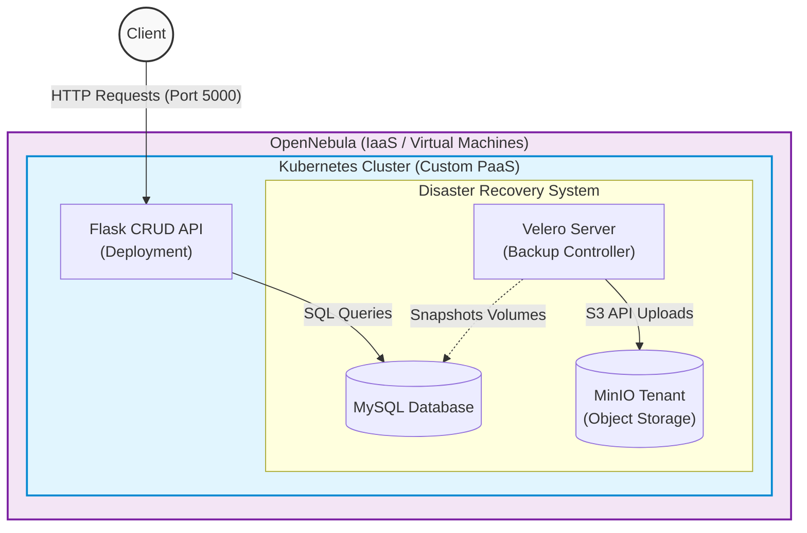
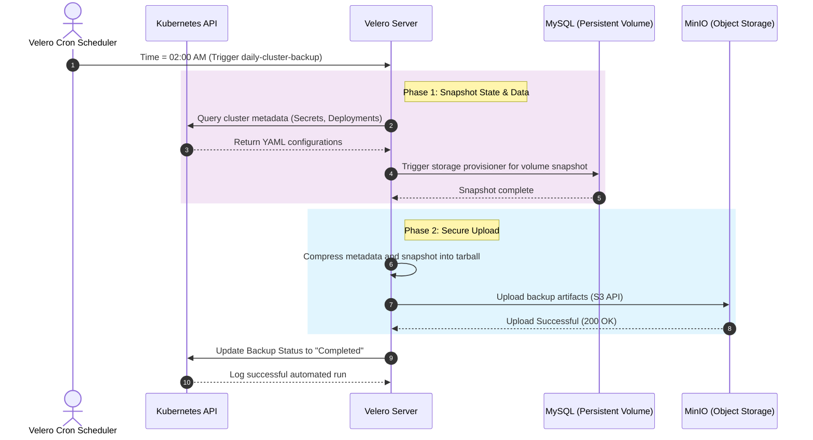
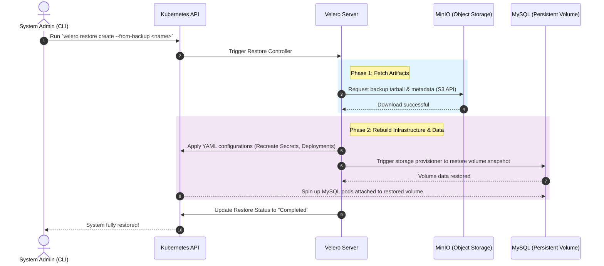

# Automated Distaster Recovery and Secure BackUps

## Group Project

Members of this group:
- Piccoli Marco
- Santaniello Mattia.

## The idea

Real world applications often rely on virtualization systems in order to maintain the offered service alive across faults and other issues. Kubernetes supports the definition and the management of multiple containers, following a duplication mechanism where a single part of the application is distributed among different replicas. Although this process increases the resiliency of the service, it is still possible that crashes could compromise the whole system; for this reason, it is fundamental to provide a crash recovery process by implementing a backup mechanism. This project aims to implement such a system by deploying a stateful application and simulating a crash scenario.

## UML Design

To understand better how the diffenent services are connected to each other, a UML diagram is presented below: 

While, in the following figure, is illustrated how the backups actually works. As you can see, there are two main phases: **Snapshot** and **Upload**.

Instead, to retrieve correctly the backups we made before, we simply **Fetch** and **Rebuild** the architecture with the last Snapshot available, as presented in the figure below:

## How to build the system?

In this section is illustrated the way to create and setup each and every single one of the services inside the architecture. 

### Velero
### MinIO
### MySQL
### Kubernetes
### CRUD API
